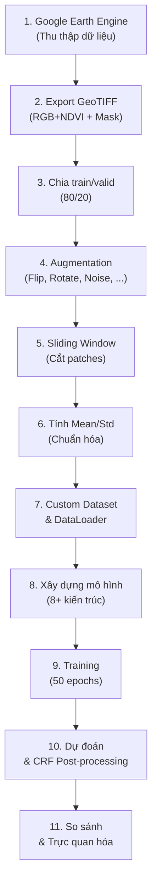

# 📄 Tài liệu chi tiết: `RVB_NAMDINH_2025.ipynb`

> **Mục đích:** Notebook này xây dựng một **pipeline hoàn chỉnh** cho bài toán **Semantic Segmentation** (phân đoạn ngữ nghĩa) lớp phủ rừng, sử dụng dữ liệu ảnh vệ tinh đa phổ thu thập từ **Google Earth Engine (GEE)** tại khu vực **Vườn Quốc gia Xuân Thủy, tỉnh Nam Định, Việt Nam**.

> **Nền tảng:** Google Colab (GPU T4), Python 3, PyTorch

---

## 📑 Mục lục tổng quan

| # | Phần | Mô tả |
|---|------|-------|
| 1 | [EXPORT DATA](#1-export-data) | Thu thập & xuất dữ liệu ảnh vệ tinh từ GEE |
| 2 | [PREPARE DATA](#2-prepare-data) | Tiền xử lý, chia tập, augmentation, tạo DataLoader |
| 3 | [BUILD MODELS](#3-build-models) | Xây dựng kiến trúc các mô hình segmentation |
| 4 | [TRAINING](#4-training) | Thiết lập loss/metric & huấn luyện |
| 5 | [PREDICTION & VISUALIZATION](#5-prediction--visualization) | Dự đoán, trực quan hóa & so sánh mô hình |
| 6 | [CODE BASE MODELS](#6-code-base-models-phụ-lục) | Phụ lục: Mã nguồn tham khảo các mô hình |

---

## 1. EXPORT DATA

> **Mục tiêu:** Thu thập ảnh vệ tinh đa phổ (RGB + NDVI) và nhãn (mask) rừng/phi rừng từ Google Earth Engine, chia thành các tile nhỏ rồi xuất ra Google Drive dưới dạng GeoTIFF.

### 1.1. Mount Google Drive & Cài đặt thư viện
- **Cell 1:** Mount Google Drive vào Colab (`/content/drive`)
- **Cell 3:** Cài đặt thư viện `rasterio` — thư viện Python chuyên đọc/ghi file raster (GeoTIFF)

### 1.2. Xác thực & kết nối Google Earth Engine
- **Cell 5:** Import thư viện `ee` (Earth Engine API) và `geemap`, xác thực tài khoản GEE bằng project `ee-sangtlu30072000`, kiểm tra kết nối

### 1.3. Định nghĩa vùng nghiên cứu (AOI)
- **Cell 7:** Tạo đối tượng hình học GEE:
  - `aoi` — Polygon bao phủ khu vực nghiên cứu (tọa độ khoảng `106.43°–106.61°E`, `20.16°–20.28°N`)
  - `point` — Điểm trung tâm dùng để canh bản đồ

### 1.4. Load Feature Collections & xử lý dữ liệu rừng
- **Cell 9:** Load các asset trên GEE:
  - `region_commune` — Ranh giới hành chính cấp xã Việt Nam
  - `rvb_2022` — Dữ liệu Rừng Việt Bắc năm 2022 (feature collection chứa thông tin phân loại rừng)
  - `tiles` — Lưới tile zoom level 14 cho khu vực VQG Xuân Thủy
  - `img_check` — Ảnh vệ tinh base tháng 01/2022
- Lọc `rvb_2022` theo mã tỉnh Nam Định (`matinh = 36`):
  - `has_forest` — Các polygon có rừng (`nggocr < 3`)
  - `non_forest` — Các polygon không có rừng (`nggocr = 3`)
- Chọn tile index 23 để xử lý

### 1.5. Hàm chia tile (Tile Processing Functions)
- **Cell 11:** Các hàm chuyển đổi tọa độ và tạo lưới tile:
  - `meters_to_lonlat(x, y)` — Chuyển từ Web Mercator sang kinh/vĩ độ
  - `lonlat_to_meters(lon, lat)` — Chuyển từ kinh/vĩ độ sang Web Mercator
  - `create_tiles(coords)` — Chia một tile lớn (zoom 14) thành các tile nhỏ hơn (zoom 16), loại bỏ tile có diện tích < 100,000 m²

> **Zoom level 16** tạo ra tile khoảng ~600m × 600m, phù hợp cho deep learning.

### 1.6. Cấu hình & thực hiện Export
- **Cell 13 (Setup Export):**
  - Năm xử lý: 2022
  - Thư mục Google Drive: `EXPORT_XUANTHUY`
  - Scale (phân giải): 1m
  - Định dạng: GeoTIFF
  - Số tile: 15

- **Cell 15 (Export chính — `export_data_for_month`):**
  - Hàm chính xử lý export cho **mỗi tháng** (T01–T12):
    1. Load ảnh base tháng tương ứng
    2. Load FeatureCollection nhãn của tháng đó (12 asset khác nhau, mỗi tháng do một người gán nhãn khác nhau)
    3. Với mỗi tile:
       - Clip ảnh 4 kênh (R, G, B, NDVI) → xuất file `Tile_RGBNDVI_Txx_lon..._lat...`
       - Tạo mask từ FeatureCollection nhãn (dùng `reduceToImage` + `ee.Reducer.first`) → xuất file `Tile_MASK_Txx_lon..._lat...`
    4. Tên file chứa tọa độ centroid của tile (13 chữ số thập phân)
  - **Lưu ý:** Tháng 6 và tháng 8 dùng thuộc tính mask là `'Forest'` (viết hoa), các tháng khác dùng `'forest'`

- **Cell 16-19 (Unusage):** Các phiên bản export cũ (export riêng image và mask, chưa gộp theo tháng) — **không sử dụng**

### 1.7. Hiển thị bản đồ
- **Cell 21:** Dùng `geemap.Map()` hiển thị:
  - Ảnh RGB gốc
  - Mask NDVI (ngưỡng ≥ 0.4)
  - Tile index đã chọn
  - Các tile con đã chia

---

## 2. PREPARE DATA

> **Mục tiêu:** Xử lý dữ liệu ảnh vệ tinh đã export, chia train/valid, augmentation, tạo patches, và đóng gói vào DataLoader cho PyTorch.

### 2.1. Hằng số & cấu hình (Const variables)
- **Cell 24:**
  - `IS_TRAINING_RGB_DATA = False` → Sử dụng **4 kênh** (R, G, B, NDVI), không chỉ RGB
  - `num_in_channels = 4` (hoặc 3 nếu chỉ RGB)
  - `num_in_channels_edge_map = 5` (khi bổ sung kênh edge map)
  - Cấu trúc thư mục trên Google Drive:
    ```
    RVB_NAMDINH_2025/
    ├── images/       # Ảnh gốc
    ├── masks/        # Mask gốc
    ├── train/
    │   ├── images/
    │   └── masks/
    ├── valid/
    │   ├── images/
    │   └── masks/
    └── checkpoints_RGB_NDVI/  # Hoặc checkpoints_RGB
    ```

### 2.2. Chia tập dữ liệu (Split Dataset)
- **Cell 26:**
  - Tỷ lệ chia: **80% train** / **20% valid**
  - Tổng: 180 file → 144 train + 36 valid
  - Liên kết image-mask qua quy tắc đổi tên: `RGBNDVI` → `MASK`
  - Shuffle ngẫu nhiên trước khi chia

### 2.3. Hiển thị mẫu dữ liệu (Show sample data)
- **Cell 28:** Hàm tiện ích:
  - `load_image_and_mask()` — Đọc file GeoTIFF bằng `rasterio`, chuẩn hóa min-max về [0,1]
  - `show_image_and_mask()` — Hiển thị cặp ảnh RGB + mask bằng matplotlib
  - `show_train_samples()` — Chọn ngẫu nhiên và hiển thị mẫu

### 2.4. Data Augmentation
- **Cell 30 (Augmentation cũ):** Sử dụng `albumentations`:
  - `HorizontalFlip`, `VerticalFlip`, `RandomRotate90`, `ShiftScaleRotate`
  - `RandomBrightnessContrast`, `GaussianBlur`, `GaussNoise`

- **Cell 32 (Augmentation mới):** Phiên bản nâng cấp, bổ sung thêm:
  - `ElasticTransform`, `GridDistortion`, `OpticalDistortion`
  - Kết hợp `OneOf` để đa dạng hóa biến đổi

### 2.5. Tiền xử lý — Sliding Window Patches (Preprocessing)
- **Cell 34:**
  - Chia ảnh lớn thành **patches nhỏ** bằng kỹ thuật **sliding window**
  - Mỗi patch có kích thước cố định (ví dụ 256×256)
  - Stride có thể overlap (để tăng dữ liệu training)
  - Lưu patches vào thư mục riêng

- **Cell 36 (Show sliding patches):** Trực quan hóa các patches đã cắt

### 2.6. Tính Mean & Std
- **Cell 38:** Tính giá trị trung bình (mean) và độ lệch chuẩn (std) trên **toàn bộ tập train** — dùng cho chuẩn hóa (normalization) khi training

### 2.7. Custom Dataset & DataLoader
- **Cell 40 (Phiên bản cơ bản):** Custom `torch.utils.data.Dataset`:
  - Load patches ảnh + mask
  - Áp dụng augmentation (cho tập train)
  - Chuẩn hóa theo mean/std đã tính
  - Trả về `(image_tensor, mask_tensor, patch_name)`

- **Cell 42 (Bổ sung kênh Edge Map):** Thêm **kênh thứ 5** — **Edge Map** (bản đồ biên):
  - Tạo edge map từ mask hoặc ảnh (Sobel/Canny)
  - `num_in_channels_edge_map = 5`
  - Giúp mô hình học tốt hơn biên giới giữa vùng rừng và phi rừng

- **Cell 44 (Bổ sung kênh HED):** Thêm kênh **HED** (Holistically-Nested Edge Detection) — phương pháp phát hiện biên dựa trên deep learning

### 2.8. Hiển thị dữ liệu DataLoader
- **Cell 46:** Duyệt qua `valid_loader` để kiểm tra shape và giá trị
- **Cell 48–49:** Trực quan hóa mẫu dữ liệu từ DataLoader

---

## 3. BUILD MODELS

> **Mục tiêu:** Xây dựng **8 kiến trúc mô hình semantic segmentation** khác nhau, tất cả đều hỗ trợ đầu vào đa kênh (RGB hoặc RGB+NDVI).

### 3.1. ResNet Backbone
- **Cell 51:** Triển khai **ResNet backbone** (pretrained trên ImageNet) dùng làm encoder cho một số mô hình. Sử dụng code gốc từ Hang Zhang.

### 3.2. Helper Functions
- **Cell 53:** Các hàm tiện ích chung cho tất cả mô hình (ví dụ: `initialize_weights`, `ConvBnRelu`, ...)

### 3.3. Các mô hình

| # | Cell | Mô hình | Năm | Đặc điểm chính |
|---|------|---------|-----|-----------------|
| 1 | 55 | **UNet (2015)** | 2015 | Encoder-Decoder + Skip connections. Kiến trúc nền tảng cho segmentation y sinh. |
| 2 | 59 | **UNet + CBAM** | — | UNet kết hợp **CBAM** (Convolutional Block Attention Module): Channel Attention + Spatial Attention. Giúp mô hình tập trung vào vùng quan trọng. |
| 3 | 61 | **UNet + CBAM (Ưu tiên NDVI)** | — | Biến thể UNet-CBAM với cơ chế **ưu tiên kênh NDVI** — áp dụng trọng số attention cao hơn cho kênh NDVI (chỉ số thực vật). |
| 4 | 65 | **Attention UNet** | 2018 | UNet với **Attention Gate** ở mỗi skip connection. Attention gate dùng tín hiệu từ decoder để lọc thông tin encoder, giảm nhiễu. |
| 5 | 68 | **SegNet (2016)** | 2016 | Encoder-Decoder sử dụng **VGG-16** làm encoder. Decoder dùng max-pooling indices để upsampling (không cần tham số). |
| 6 | 70 | **PSPNet (2017)** | 2017 | **Pyramid Scene Parsing Network** — dùng Pyramid Pooling Module để thu thập ngữ cảnh ở nhiều scale khác nhau. |
| 7 | 72 | **ENet (2016)** | 2016 | Mô hình **nhẹ, nhanh** (Efficient Neural Network), thiết kế cho real-time segmentation. |
| 8 | 74 | **UNetResnet** | — | UNet sử dụng **ResNet pretrained** làm encoder. Kết hợp sức mạnh feature extraction của ResNet với decoder UNet. |
| 9 | 76 | **DeepLabV3+ (2018)** | 2018 | Sử dụng **Atrous/Dilated Convolution** + **ASPP** (Atrous Spatial Pyramid Pooling) + Decoder module. State-of-the-art cho segmentation. |

> [!NOTE]
> Tất cả mô hình đều được xây dựng bằng **PyTorch** (`torch.nn.Module`), hỗ trợ cấu hình số kênh đầu vào (`num_in_channels`) để linh hoạt chuyển giữa RGB (3 kênh) và RGB+NDVI (4 kênh).

---

## 4. TRAINING

### 4.1. Thiết lập Loss & Metric
- **Cell 78 (Loss & Metric cơ bản):**
  - **Loss function:** Kết hợp `CrossEntropyLoss` + `DiceLoss` (Compound Loss)
  - **Metrics:** Accuracy, IoU (Intersection over Union), Dice coefficient, Precision, Recall, F1-Score

- **Cell 80 (Loss & Metric nâng cấp):** Phiên bản mới với thêm các metric hoặc loss function bổ sung

### 4.2. Hàm Training chính
- **Cell 82 (Training cơ bản):** Hàm `train_model()`:
  - Vòng lặp epoch
  - Forward pass → tính loss → backward → optimizer step
  - Đánh giá trên tập validation mỗi epoch
  - Lưu model tốt nhất (best validation loss/IoU)
  - Checkpoint tự động

- **Cell 84 (Training nâng cấp):** Phiên bản mới với:
  - Learning rate scheduler
  - Early stopping
  - Logging chi tiết hơn

### 4.3. Huấn luyện từng mô hình

| Cell | Mô hình | Epochs | Ghi chú |
|------|---------|--------|---------|
| 86 | UNet | 50 | Baseline |
| 88 | UNet + CBAM | 50 | Thêm attention |
| 90 | UNet + CBAM (Ưu tiên NDVI) | 50 | Nhấn mạnh kênh NDVI |
| 92 | UNet + CBAM (Ưu tiên NDVI) + Tiền xử lý | 50 | Có thêm bước preprocessing |
| 94 | Attention UNet | 50 | Attention Gate |
| 96 | ENet | 50 | Mô hình nhẹ |
| 98 | UNetResnet | — | ResNet backbone |
| 100 | SegNet | 50 | VGG-16 encoder |
| 102 | PSPNet | — | Pyramid Pooling |
| 104 | DeepLabV3+ | 50 | Atrous convolution |

---

## 5. PREDICTION & VISUALIZATION

### 5.1. Hàm dự đoán & trực quan hóa
- **Cell 106 (Predict & Visualize cơ bản):** Hàm hiển thị:
  - Ảnh đầu vào (RGB)
  - Mask thực tế (Ground Truth)
  - Mask dự đoán (Prediction)
  - Đánh giá trực quan

- **Cell 108 (CRF Post-processing):** Cài đặt thư viện `pydensecrf`:
  - **Conditional Random Field (CRF)** dùng để hậu xử lý kết quả segmentation
  - Làm mịn biên, loại bỏ nhiễu, cải thiện chất lượng mask dự đoán

- **Cell 110 (Predict nâng cấp):** Phiên bản mới với:
  - CRF post-processing
  - Tính metrics chi tiết trên tập test
  - Lưu kết quả

### 5.2. Dự đoán trên ảnh đơn (Single Image Prediction)
- **Cell 113 (Load model):** Load model từ checkpoint đã lưu
- **Cell 115 (Combine data):** Kết hợp dữ liệu từ nhiều nguồn
- **Cell 117:** Hàm `predict_from_test_loader_by_path()` — dự đoán trên ảnh cụ thể theo đường dẫn
- **Cell 119:** Hàm dự đoán theo tọa độ kinh/vĩ độ qua các quý (quarters)

### 5.3. Dự đoán cho từng mô hình

| Cell | Mô hình |
|------|---------|
| 121 | UNet |
| 123 | Attention UNet |
| 125 | ENet |
| 127 | UNetResnet |
| 129 | SegNet |
| 131 | UNet CBAM |
| 133 | UNet CBAM (Ưu tiên NDVI) |
| 135 | DeepLabV3+ |
| 137 | UNet + Edge Map |
| 139 | UNet CBAM Priority + Edge Map |

### 5.4. So sánh mô hình (Compare Models)
- **Cell 141:** So sánh hiệu năng giữa tất cả các mô hình:
  - Bảng metrics (IoU, Dice, Accuracy, Precision, Recall, F1)
  - Trực quan hóa so sánh (biểu đồ)

### 5.5. Trực quan hóa kết quả (Visualize Result)
- **Cell 143:** Trực quan hóa tổng hợp kết quả cuối cùng

---

## 6. CODE BASE MODELS (Phụ lục)

> Phần này chứa **mã nguồn tham khảo** và các phiên bản thay thế của mô hình.

| Cell | Nội dung |
|------|----------|
| 145–148 | **UNet (Original)** — Phiên bản Keras/TensorFlow |
| 149–151 | **UNet + Attention** — Phiên bản PyTorch khác |
| 152–154 | **EfficientNet** — Sử dụng TensorFlow/Keras |
| 155 | References / tài liệu tham khảo |
| 156–158 | **DINOv2** — Facebook's self-supervised ViT model (thử nghiệm) |

---

## 🗺️ Sơ đồ luồng xử lý tổng quan



---

## 📊 Tóm tắt dữ liệu

| Thông số | Giá trị |
|----------|---------|
| **Vùng nghiên cứu** | VQG Xuân Thủy, Nam Định |
| **Nguồn ảnh** | Google Earth Engine |
| **Năm dữ liệu** | 2022 (12 tháng) |
| **Số kênh ảnh** | 4 (R, G, B, NDVI) — hoặc 5 với edge map |
| **Phân giải export** | 1m |
| **Số tile (zoom 16)** | 15 tile/tháng |
| **Tổng ảnh** | 180 file |
| **Chia tập** | 144 train / 36 valid |
| **Số lớp phân đoạn** | 2 (Rừng / Phi rừng) |
| **Định dạng** | GeoTIFF |

---

## 🔑 Các điểm đáng chú ý

> [!IMPORTANT]
> **Đa kênh (Multi-spectral):** Notebook hỗ trợ cả RGB (3 kênh) và RGB+NDVI (4 kênh), cho phép đánh giá tác động của chỉ số thực vật NDVI lên hiệu quả phân đoạn.

> [!TIP]
> **Edge Map / HED:** Có thực nghiệm thêm kênh thứ 5 (edge map hoặc HED) để cung cấp thông tin biên giới cho mô hình, giúp phân đoạn chính xác hơn ở vùng ranh giới rừng.

> [!WARNING]
> **Nhất quán nhãn:** Tháng 6 và tháng 8 có thuộc tính mask là `'Forest'` (viết hoa F), trong khi các tháng khác dùng `'forest'` (viết thường). Đây là điểm cần lưu ý khi tái sử dụng code.

> [!NOTE]
> **Đa mô hình:** Notebook triển khai và so sánh **9+ mô hình** segmentation khác nhau, từ kinh điển (UNet, SegNet) đến hiện đại (DeepLabV3+, PSPNet), và các biến thể có attention mechanism (CBAM, Attention Gate), cho phép đánh giá toàn diện.
